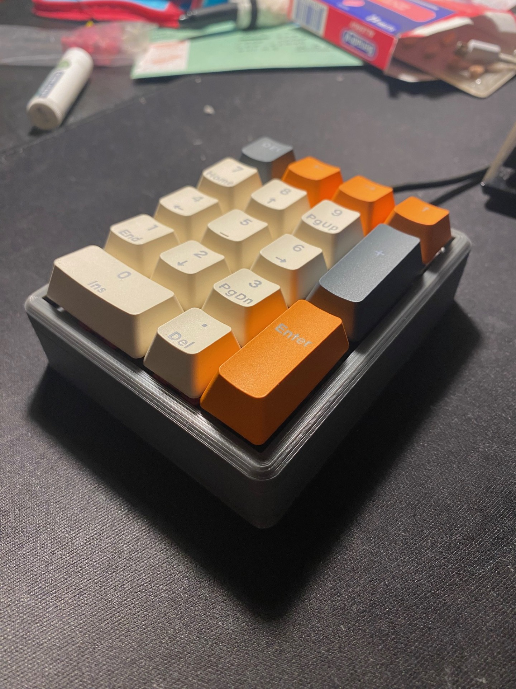

# Enthusiast Mechanical Keypad from a Repurposed Keyboard

This project details the transformation of a standard office membrane keyboard into a clean, enthusiast-grade mechanical keypad, complete with lubed switches and a custom-designed case.

The core of the build involves salvaging the original controller PCB from the donor keyboard and reverse-engineering its matrix. This allows for a plug-and-play final product without any custom firmware or programming.

## Project Media

All project images, including build photos and diagrams, are available in the [`pictures`](pictures) directory.

## Key Features

* **Enthusiast Feel:** Built with fully mechanical switches, lubed for a smooth and quiet operation.
* **Custom-Fit Case:** A sleek, minimalist case was designed in CAD and 3D-printed to perfectly house the components.
* **Zero Programming:** By reusing the original membrane controller, the keypad is instantly recognized as a standard USB HID device.
* **Upcycled Hardware:** Gives a new, high-quality life to an old piece of e-waste.

## The Process

1.  **Salvage:** An old office membrane keyboard was disassembled to extract its small controller PCB.
2.  **Reverse Engineering:** I mapped the keyboard matrix by manually probing the pinouts on the controller. This identified which traces corresponded to each key. The full pinout map is available in [`reversed_encoder_pinout`](reversed_encoder_pinout).
3.  **Soldering:** The mechanical switches (pre-lubed) were carefully hand-soldered directly to the contacts on the salvaged PCB.
4.  **Design & Print:** A custom case was modeled to provide a snug fit for the PCB and switches, resulting in a clean, modern aesthetic.
5.  **Final Assembly:** All components were assembled into the new case to create the final, fully functional keypad.
